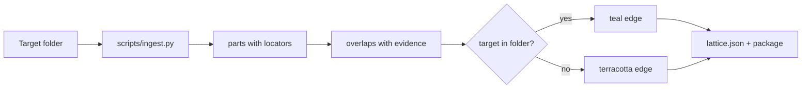
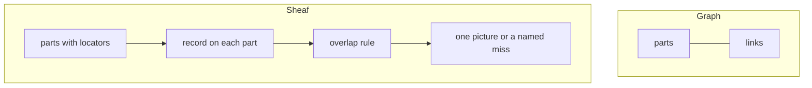

<div align="center">

**sheaf-port**

Take a folder. Build a typed index. Draw it as a lattice.
Leave a structure you can run on the next folder.

[Start](START.md) · [Handoff](HANDOFF.md) · [For agents](AGENTS.md) · [What a sheaf is](docs/SHEAF.md) · [Glossary](docs/GLOSSARY.md)

</div>

---

## Copy this

Sanity check on this repo (should print 6 parts, 4 teal links):

```bash
git clone https://github.com/manutej/sheaf-port
cd sheaf-port
python scripts/ingest.py fixtures/codebase --out ./out
cat out/STRUCTURE.md
```

Point it at **their** repo:

```bash
python scripts/ingest.py /path/to/their/repo --out ./out-their-repo
```

Paste this to another model that can read files:

```
You are reading github.com/manutej/sheaf-port.
Read AGENTS.md, then skills/sheaf-ingest/SKILL.md, then HANDOFF.md.
Target folder: <PATH OR CLONE URL>
Run: python scripts/ingest.py <TARGET> --out ./out
Do not invent links. Do not treat README paragraphs as parts.
Return the four files under ./out and quote STRUCTURE.md.
```

No pip. Python 3.11+. Stdlib only.

## What you just built

<figure>
<svg viewBox="0 0 920 220" width="100%" role="img" aria-label="Folder becomes four files">
  <rect x="8" y="70" width="150" height="80" rx="10" fill="#F4EFE6" stroke="#2C2A28"/>
  <text x="83" y="116" text-anchor="middle" font-size="14" font-family="ui-sans-serif,system-ui" fill="#2C2A28">folder</text>
  <path d="M168 110 H214" stroke="#2C2A28" stroke-width="2" marker-end="url(#a)"/>
  <rect x="220" y="70" width="190" height="80" rx="10" fill="#E7F6F3" stroke="#2A9D8F"/>
  <text x="315" y="108" text-anchor="middle" font-size="13" font-family="ui-sans-serif,system-ui" fill="#2C2A28">scripts/ingest.py</text>
  <text x="315" y="128" text-anchor="middle" font-size="11" font-family="ui-sans-serif,system-ui" fill="#5C5854">parts + observed links</text>
  <path d="M418 110 H464" stroke="#2C2A28" stroke-width="2"/>
  <rect x="470" y="16" width="200" height="44" rx="8" fill="#FAF7F2" stroke="#2C2A28"/>
  <text x="570" y="44" text-anchor="middle" font-size="12" font-family="ui-sans-serif,system-ui">out/STRUCTURE.md</text>
  <rect x="470" y="68" width="200" height="44" rx="8" fill="#FAF7F2" stroke="#2C2A28"/>
  <text x="570" y="96" text-anchor="middle" font-size="12" font-family="ui-sans-serif,system-ui">out/index.json</text>
  <rect x="470" y="120" width="200" height="44" rx="8" fill="#E7F6F3" stroke="#2A9D8F"/>
  <text x="570" y="148" text-anchor="middle" font-size="12" font-family="ui-sans-serif,system-ui">out/lattice.json</text>
  <rect x="470" y="172" width="200" height="44" rx="8" fill="#FAF7F2" stroke="#2C2A28"/>
  <text x="570" y="200" text-anchor="middle" font-size="12" font-family="ui-sans-serif,system-ui">out/domain.package.yaml</text>
  <rect x="700" y="70" width="200" height="80" rx="10" fill="#F8E7E1" stroke="#C65D3B"/>
  <text x="800" y="108" text-anchor="middle" font-size="12" font-family="ui-sans-serif,system-ui">drop lattice.json into</text>
  <text x="800" y="128" text-anchor="middle" font-size="12" font-family="ui-sans-serif,system-ui">stalks-and-sections</text>
  <defs><marker id="a" markerWidth="8" markerHeight="8" refX="6" refY="4" orient="auto"><path d="M0,0 L8,4 L0,8" fill="#2C2A28"/></marker></defs>
</svg>
<figcaption>Human summary first. Lattice is optional. Package is what you reuse.</figcaption>
</figure>

| File | Open it when |
|---|---|
| `out/STRUCTURE.md` | You want the rebuild command and the teal / terracotta counts |
| `out/index.json` | An agent needs counts without the drawing |
| `out/lattice.json` | You want the picture next door |
| `out/domain.package.yaml` | You will run the same recipe on a sibling folder |

## What the colours mean

<figure>
<svg viewBox="0 0 920 160" width="100%" role="img" aria-label="Teal means resolved, terracotta means missing">
  <rect x="20" y="30" width="200" height="70" rx="10" fill="#FAF7F2" stroke="#2C2A28"/>
  <text x="120" y="72" text-anchor="middle" font-size="14" font-family="ui-sans-serif,system-ui">api.py</text>
  <path d="M230 65 H390" stroke="#2A9D8F" stroke-width="6"/>
  <rect x="400" y="30" width="200" height="70" rx="10" fill="#FAF7F2" stroke="#2C2A28"/>
  <text x="500" y="72" text-anchor="middle" font-size="14" font-family="ui-sans-serif,system-ui">auth.login</text>
  <text x="310" y="24" text-anchor="middle" font-size="12" font-family="ui-sans-serif,system-ui" fill="#2A9D8F">teal — import resolves</text>
  <rect x="20" y="120" width="880" height="28" rx="6" fill="#F8E7E1"/>
  <text x="460" y="139" text-anchor="middle" font-size="12" font-family="ui-sans-serif,system-ui" fill="#C65D3B">terracotta — the named target is not in the folder (read the edge evidence)</text>
</svg>
<figcaption>v0 teal is “target exists here.” It is not permission to merge.</figcaption>
</figure>



## How an agent should do it

1. Read this repo first, in this order: `AGENTS.md` → `skills/sheaf-ingest/SKILL.md` → `HANDOFF.md`.
2. Take the **target** path the user named. Do not ingest `node_modules`, `.git`, or `dist`.
3. Run `python scripts/ingest.py <TARGET> --out ./out`.
4. If that script is missing, walk with list / read / grep and still emit the same four files. No invented links.
5. Quote `out/STRUCTURE.md`. Stop.

Longer copy-paste: [AGENT-PROMPT.md](AGENT-PROMPT.md).

## What a sheaf adds (one screen)

A **graph** says which pieces are linked.

A **sheaf** also says what data lives on each piece, how to read that data on an overlap, and whether the overlap holds.



Four words to keep apart: **sheaf** (the object) · **lattice** (the picture) · **package** (the reusable rule) · **write-gate** (optional, later).

Longer: [docs/SHEAF.md](docs/SHEAF.md). Words: [docs/GLOSSARY.md](docs/GLOSSARY.md).

## What the walker covers

| Source | What becomes a part | What becomes an overlap |
|---|---|---|
| `.py` | modules, functions, classes | `import` / `from X import Y` |
| `.md` | pages | `[text](path)` and `[[page]]` |
| `.ts` `.js` `.tsx` `.jsx` | files + exported names | relative `import … from './x'` |

Cap 120 parts. Package imports (`json`, `react`) are *not* nodes — they are not in the folder. Relative imports that miss are terracotta.

TypeScript monorepos that need pooling: [stalks-and-sections](https://github.com/manutej/stalks-and-sections) `npm run sheaf:ingest`. Still keep `domain.package.yaml` from this run.

## What this is not

- Not a write-gate. That is a later check, if you ask for one.
- Not “the folder is ported.”
- Not “it is teal, so merge.”
- Not a knowledge graph with extra words.
- Not `pip install` then `python -m sheaf_port`. Use `scripts/ingest.py`.

## Layout

```
sheaf-port/
├─ START.md HANDOFF.md AGENTS.md AGENT-PROMPT.md
├─ scripts/ingest.py          ← run this
├─ skills/sheaf-ingest/       ← LLM procedure
├─ docs/SHEAF.md GLOSSARY.md REFERENCES.md
├─ fixtures/codebase          ← 6-part sanity check
├─ profiles/                  starting packages
└─ src/sheaf_port/            reference runtime (lags the script)
```

## License

MIT © 2026 Manu.
